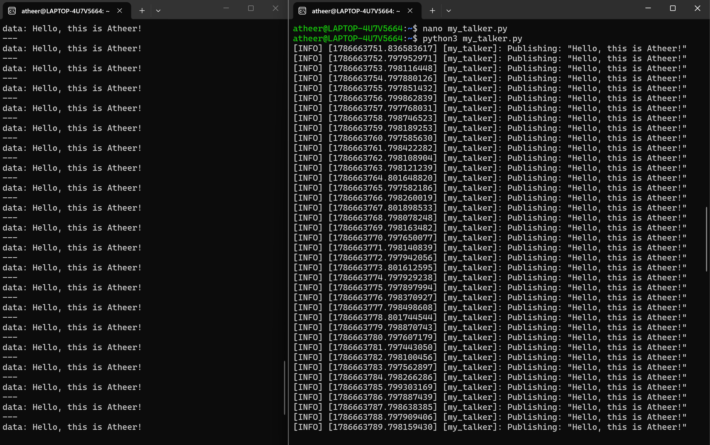
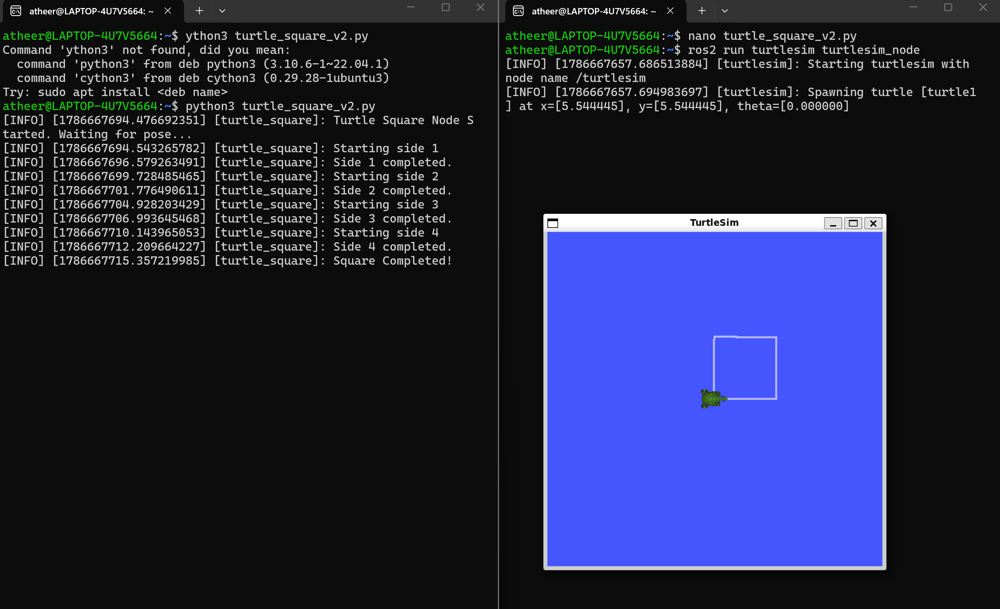

🤖 ROS 2 Course Assignments

This repository contains my practical ROS 2 assignments, focusing on basic communication between nodes and robot movement using Turtlesim.
The tasks were completed using Python and ROS 2 Humble on Ubuntu.

📌 Task 1 — Publisher and Subscriber
Created a simple ROS 2 Publisher and Subscriber system.
The Publisher sends a custom message, while the Subscriber receives and displays it in the console.

What I practiced:
- Creating ROS 2 nodes
- Creating a Publisher
- Creating a Subscriber
- Using ROS 2 topics
- Sending and receiving messages

📷 Task 1 Preview

🐢 Task 2 — Turtlesim Square Movement
Programmed the Turtlesim robot to move in a square-shaped path.
The turtle moves forward, turns 90 degrees, and repeats the movement until the square is completed.

What I practiced:
- Controlling the Turtlesim robot
- Using geometry_msgs/Twist
- Working with turtle movement and rotation
- Implementing movement logic
- Creating a square path using ROS 2

📷 Task 2 Preview

🛠️ Environment & Technologies
- OS: Ubuntu 22.04
- ROS: ROS 2 Humble
- Language: Python
- Simulation: Turtlesim

🎯 Learning Outcomes
Through these assignments, I gained practical experience with:
- ROS 2 Nodes
- Publisher and Subscriber communication
- ROS 2 Topics
- Message types
- Robot motion control
- Turtlesim simulation
- Python programming for robotics
